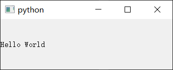
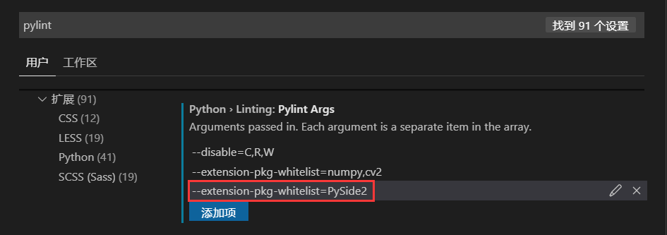

# 安装PySide2
打开Qt官网的下载页面([https://download.qt.io/](https://download.qt.io/))，下载对应版本的wheel包。  

* pyside2 : 包含Qt库的所有PySide2模块，依赖shiboken2包。
* shiboken2 : 包含shiboken2模块和PySide2辅助功能。
* shiboken2_generator : 用于由C++代码生成Python绑定的工具。

> 使用PySide2不需要安装shiboken2_generator，它是用来从零构建PySide2的。

部分版本的下载页面连接 :  

|包|OS|Python|Bit| 下载页面 |
|:-:|:-:|:-:|:-:|:-:|
|shiboken2|Windows|Python3|32-bit|[Details](https://download.qt.io/snapshots/ci/pyside/5.12/latest/pyside2/shiboken2-5.12.5a1.dev1566934103-5.12.5-cp35.cp36.cp37-none-win32.whl.mirrorlist)|
|pyside2|Windows|Python3|32-bit|[Details](https://download.qt.io/snapshots/ci/pyside/5.12/latest/pyside2/PySide2-5.12.5a1.dev1566934103-5.12.5-cp35.cp36.cp37-none-win32.whl.mirrorlist)|
|shiboken2|Windows|Python3|64-bit|[Details](https://download.qt.io/snapshots/ci/pyside/5.12/latest/pyside2/shiboken2-5.12.5a1.dev1566934103-5.12.5-cp35.cp36.cp37-none-win_amd64.whl.mirrorlist)|
|pyside2|Windows|Python3|64-bit|[Details](https://download.qt.io/snapshots/ci/pyside/5.12/latest/pyside2/PySide2-5.12.5a1.dev1566934103-5.12.5-cp35.cp36.cp37-none-win_amd64.whl.mirrorlist)|
|shiboken2|Linux|Python3|64-bit|[Details](https://download.qt.io/snapshots/ci/pyside/5.12/latest/pyside2/shiboken2-5.12.5a1.dev1566934103-5.12.5-cp35.cp36.cp37-abi3-manylinux1_x86_64.whl.mirrorlist)|
|pyside2|Linux|Python3|64-bit|[Details](https://download.qt.io/snapshots/ci/pyside/5.12/latest/pyside2/PySide2-5.12.5a1.dev1566934103-5.12.5-cp35.cp36.cp37-abi3-manylinux1_x86_64.whl.mirrorlist)|
|shiboken2|Mac OS X|Python3|32-bit|[Details](https://download.qt.io/snapshots/ci/pyside/5.12/latest/pyside2/shiboken2-5.12.5a1.dev1566934103-5.12.5-cp35.cp36.cp37-abi3-macosx_10_12_intel.whl.mirrorlist)|
|pyside2|Mac OS X|Python3|64-bit|[Details](https://download.qt.io/snapshots/ci/pyside/5.12/latest/pyside2/PySide2-5.12.5a1.dev1566934103-5.12.5-cp35.cp36.cp37-abi3-macosx_10_12_intel.whl.mirrorlist)|

下载完成后使用pip安装wheel包即可 :  
```bash
pip install shiboken2.whl
pip install pyside2.whl
```

测试程序 : 
```Python
import sys
from PySide2.QtWidgets import QApplication, QLabel
                                                     
if __name__ == "__main__":
    app = QApplication(sys.argv)
    label = QLabel("Hello World")
    label.show()
    sys.exit(app.exec_())
```


> 在VS Code中pylint会在import PySide2时报错，因为它默认不加载C/C++库。  
> 在Pylint Args中添加`--extension-pkg-whitelist=PySide2`即可消除这个报错。
>
>