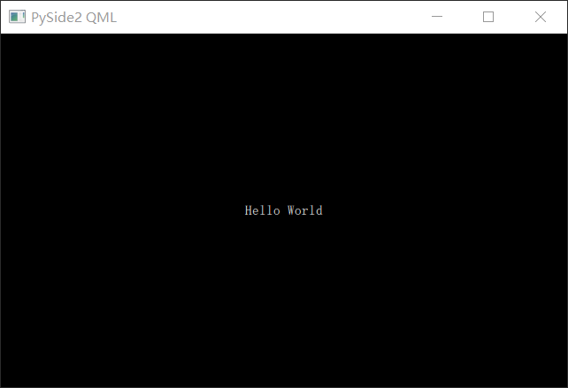

# 加载QML
QML是在Qt Quick中用来描述GUI界面的声明式脚本语言，并支持嵌入ECMAScript实现一些简单的逻辑。
> QML主要用于描述界面，复杂的业务逻辑主要由C++或Python来实现。

下面是一段QML代码(文件名为`mainwindow.qml`)，暂时不管他的功能 :  
```QML
Window {
    id: mainWindow
    visible: true // 是否可见，请注意默认值是false不可见
    width: 640
    height: 400
    title: "PySide2 QML"

    Rectangle {
        anchors.fill: parent
        color: "black"

        Text {
            anchors.centerIn: parent
            color: "white"
            text: "Hello World"
        }
    }
}
```

使用Python加载QML并显示出来 :  
```Python
import sys
from PySide2.QtGui import QGuiApplication
from PySide2.QtQml import QQmlApplicationEngine

if __name__ == "__main__":
    app = QGuiApplication(sys.argv)
    engine = QQmlApplicationEngine("mainwindow.qml")

    sys.exit(app.exec_())
```

这就是一个最基本的QML程序。
* 每一个Qt的应用程序都需要一个Application对象(包含`QCoreApplication`、`QGuiApplication`、`QApplication`)来运行。
* `QQmlApplicationEngine`对象用来加载运行qml的代码。

运行Python程序 :  
