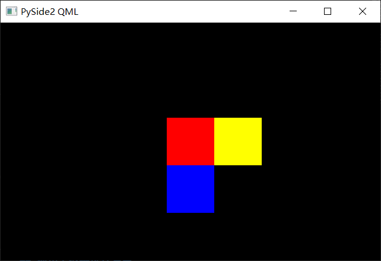
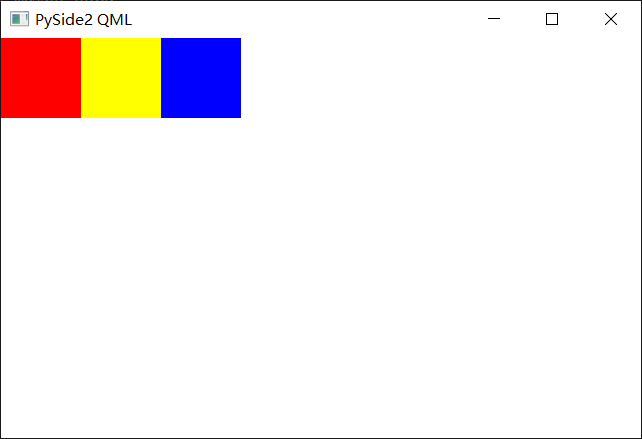
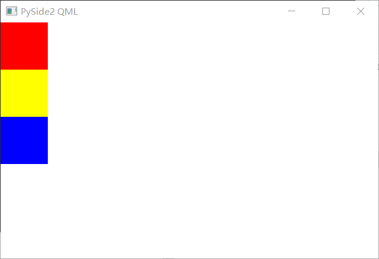
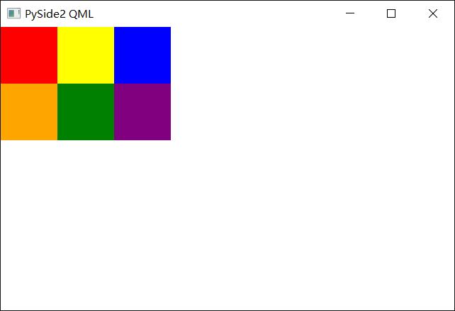
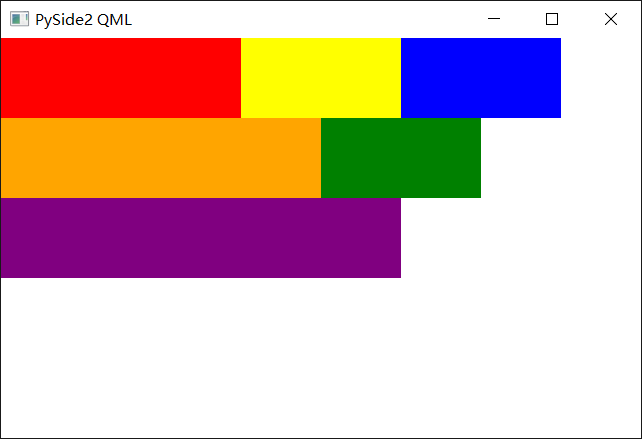
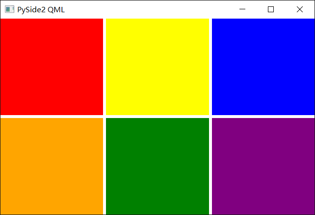

# QML布局
QML可以使用`x`、`y`、`z`三个属性设置对象的位置，其中`z`更大的对象覆盖更小的对象。直接使用这些属性既不方便也不美观，通常使用布局功能来设置对象的位置。

在QML中有三种常用的布局工具：锚、定位器、布局管理器。

## 使用锚进行布局
锚(`anchors`)是所有可视对象的父类Item的属性，用来标记不同对象直接的相关关系。
```QML
import QtQuick 2.13
import QtQuick.Window 2.13

Window {
    id: mainWindow
    visible: true // 是否可见，请注意默认值是false不可见
    width: 640
    height: 400
    title: "PySide2 QML"

    Rectangle {
        color: "black"

        anchors.fill: parent // 填满父对象
    }

    Rectangle {
        id: red         // id为red，可以在任何地方通过red操作这个对象
        width: 80       // 宽80
        height: 80      // 高80
        color:"red"     // 红色

        anchors.centerIn: parent // 与父对象中心对齐
    }

    Rectangle {
        width: 80
        height: 80
        color:"yellow"

        
        anchors.top : red.top // 上边沿和red的上边沿对齐，即y相同
        anchors.left : red.right // 左边沿和red的右边沿对齐
    }

    Rectangle {
        width: 80
        height: 80
        color:"blue"

        anchors.top : red.bottom // 上边沿和red的下边沿对齐
        anchors.left : red.left // 左边沿和red的左边沿对齐，即x相同
    }
}
```


## 使用定位器进行布局
定位器有四个：Row(行定位器)、Column(列定位器)、Grid(栅格定位器)、Flow(流式定位器)。

### Row
* Row定位器将子对象横着排成一行
```QML
import QtQuick 2.13
import QtQuick.Window 2.13

Window {
    id: mainWindow
    visible: true // 是否可见，请注意默认值是false不可见
    width: 640
    height: 400
    title: "PySide2 QML"

    // 行定位器
    Row {
        Rectangle {
            width: 80       // 宽80
            height: 80      // 高80
            color:"red"     // 红色
        }

        Rectangle {
            width: 80
            height: 80
            color:"yellow"
        }

        Rectangle {
            width: 80
            height: 80
            color:"blue"
        }
    }
}
```


### Column
* Column定位器将子对象竖着排成一列
```QML
import QtQuick 2.13
import QtQuick.Window 2.13

Window {
    id: mainWindow
    visible: true // 是否可见，请注意默认值是false不可见
    width: 640
    height: 400
    title: "PySide2 QML"

    // 列定位器
    Column {
        Rectangle {
            width: 80       // 宽80
            height: 80      // 高80
            color:"red"     // 红色
        }

        Rectangle {
            width: 80
            height: 80
            color:"yellow"
        }

        Rectangle {
            width: 80
            height: 80
            color:"blue"
        }
    }
}
```


### Gird
* Grid定位器根据设定的行数与列数，将子对象从左到右、从上到下依次排列
```QML
import QtQuick 2.13
import QtQuick.Window 2.13

Window {
    id: mainWindow
    visible: true // 是否可见，请注意默认值是false不可见
    width: 640
    height: 400
    title: "PySide2 QML"

    // 栅格定位器
    Grid {
        rows: 2   // 2行
        columns: 3 // 3列

        Rectangle {
            width: 80       // 宽80
            height: 80      // 高80
            color:"red"     // 红色
        }

        Rectangle {
            width: 80
            height: 80
            color:"yellow"
        }

        Rectangle {
            width: 80
            height: 80
            color:"blue"
        }

        Rectangle {
            width: 80
            height: 80
            color:"orange"
        }

        Rectangle {
            width: 80
            height: 80
            color:"green"
        }

        Rectangle {
            width: 80
            height: 80
            color:"purple"
        }
    }
}
```


### Flow
* Flow定位器将子对象从左到右依次排列，当自身宽度不足以放下下一个子对象时换行
```QML
import QtQuick 2.13
import QtQuick.Window 2.13

Window {
    id: mainWindow
    visible: true // 是否可见，请注意默认值是false不可见
    width: 640
    height: 400
    title: "PySide2 QML"

    // 流式定位器
    Flow {
        anchors.fill: parent //填满父对象(即窗口)

        Rectangle {
            width: 240      // 宽
            height: 80      // 高
            color:"red"
        }

        Rectangle {
            width: 160
            height: 80
            color:"yellow"
        }

        Rectangle {
            width: 160
            height: 80
            color:"blue"
        }

        Rectangle {
            width: 320
            height: 80
            color:"orange"
        }

        Rectangle {
            width: 160
            height: 80
            color:"green"
        }

        Rectangle {
            width: 400
            height: 80
            color:"purple"
        }
    }
}
```
  

## 使用布局管理器进行布局
布局管理器有三个：RowLayout、ColumnLayout、GridLayout
* 需要加载Layouts模块`import QtQuick.Layouts 1.13`
* 布局管理器和定位器类似，区别在于布局管理器处理可定位元素的位置以外，还能调节元素的大小。

```QML
import QtQuick 2.13
import QtQuick.Window 2.13
import QtQuick.Layouts 1.13

Window {
    id: mainWindow
    visible: true // 是否可见，请注意默认值是false不可见
    width: 640
    height: 400
    title: "PySide2 QML"

    // 列布局管理器
    ColumnLayout {
        anchors.fill: parent
        
        // 行布局管理器
        RowLayout {
            Layout.fillWidth: true    // 宽度填满布局
            Layout.fillHeight: true   // 高度填满布局

            Rectangle {
                Layout.fillWidth: true
                Layout.fillHeight: true
                color: "red"
            }

            Rectangle {
                Layout.fillWidth: true
                Layout.fillHeight: true
                color: "yellow"
            }

            Rectangle {
                Layout.fillWidth: true
                Layout.fillHeight: true
                color: "blue"
            }
        }

        // 行布局管理器
        RowLayout {
            Layout.fillWidth: true    // 宽度填满布局
            Layout.fillHeight: true   // 高度填满布局

            Rectangle {
                Layout.fillWidth: true
                Layout.fillHeight: true
                color: "orange"
            }

            Rectangle {
                Layout.fillWidth: true
                Layout.fillHeight: true
                color: "green"
            }

            Rectangle {
                Layout.fillWidth: true
                Layout.fillHeight: true
                color: "purple"
            }
        }
    }
}
```

  

参考 :   
* QML
  * [anvhors](https://doc.qt.io/qt-5/qml-qtquick-item.html#anchors-prop)
  * [Row](https://doc.qt.io/qt-5/qml-qtquick-row.html)
  * [Column](https://doc.qt.io/qt-5/qml-qtquick-column.html)
  * [Grid](https://doc.qt.io/qt-5/qml-qtquick-grid.html)
  * [Flow](https://doc.qt.io/qt-5/qml-qtquick-flow.html)
  * [RowLayout](https://doc.qt.io/qt-5/qml-qtquick-layouts-rowlayout.html)
  * [ColumnLayout](https://doc.qt.io/qt-5/qml-qtquick-layouts-columnlayout.html)
  * [GridLayout](https://doc.qt.io/qt-5/qml-qtquick-layouts-gridlayout.html)